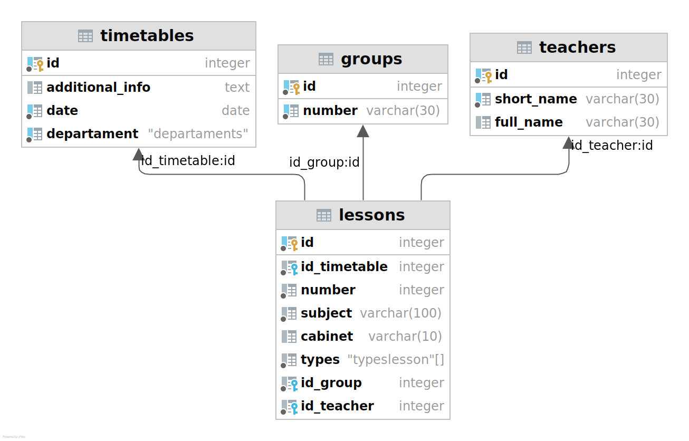

# Бот для получения расписания УАвиаК
TODO: написать бота для ВК

## Как запустить

```
# Получить простой конфиг для примера
python main.py --config config.ini simple-config
# Возможные варианты запуска 
# api, vkbot, add-timetable, simple-config
```

## Схема базы данных
